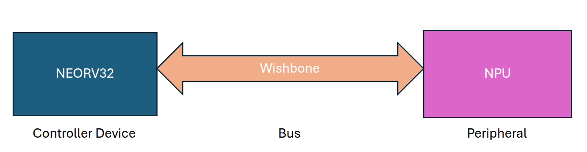
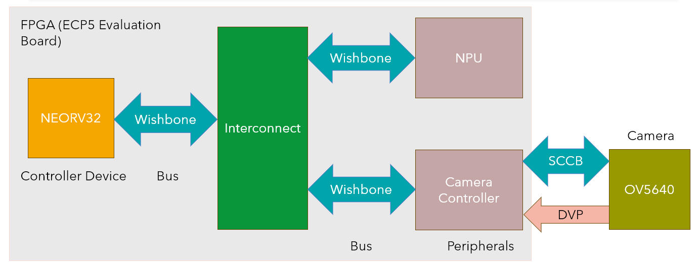
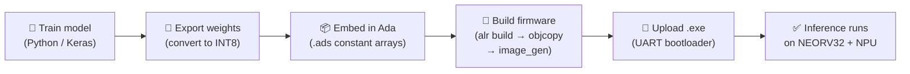

# Wishbone NPU

**A minimal, open-source Neural Processing Unit for RISC-V soft-core SoCs — built from the ground up in VHDL and Ada.**

The Wishbone NPU is a hardware peripheral that accelerates CNN and MLP workloads by performing selected operations in hardware. 
It connects to any softcore with a [Wishbone B4](https://cdn.opencores.org/downloads/wbspec_b4.pdf) bus and offloads common ML operations — dense layers, convolutions, activations, and pooling — to dedicated hardware. Instead of burning CPU cycles on matrix math, you write operands to the NPU, trigger an operation, and read back results.

The reference implementation runs on the [NEORV32](https://github.com/stnolting/neorv32) RISC-V soft-core on a **Lattice ECP5U5MG-85F** FPGA, with an Ada firmware stack and multiple demo applications. 
**The NPU itself is platform-independent VHDL — it works with any Wishbone master on any FPGA.**

Refer to the [project report](https://github.com/dipenarathod/Core-NPU/blob/main/Team%2028%20-%20Report%205.0.pdf) for a deep dive into the research, technical choices, interaction diagrams, UML diagrams, test cases, challenges, areas for improvement, etc.  

Watch this [video](https://youtu.be/6WUX9J_9Snc?si=NnZ7Qx5rK2lwi1Ah) for an overview of the complete system + a demo showing the system running CNN inference on a live camera feed to detect rock-paper-scissors hand gestures.

Developed as a capstone project at Penn State, sponsored by [AdaCore](https://www.adacore.com/).

---

## Outline
1. Architecture
2. Supported Operations
3. Repository Structure
4. End-to-end Workflow
5. Dependencies
6. Quickstart
7. Using the NPU in Your Own Design
8. Resource Usage on Lattice ECP5U5MG-85F FPGA + Constraints
9. Performance
10. Video Guides
11. Related Repositories
12. Contributing
13. Ideas for Improvement
14. Acknowledgments

## Architecture

The NPU Wishbone peripheral is connected to the NEORV32 using the NEORV32's XBUS, which supports the Wishbone communication standard.
All programs run on the NEORV32. The NEORV32 sends data outside of its mapped address range onto the XBUS, allowing it to read/write data and control commands to the NPU. 



The following shows the system architecture for real-time computer-vision tasks:


---

## Supported Operations

The NPU handles all operations through a single Finite State Machine controlled by opcodes. Data is stored as **4 INT8 values packed per 32-bit word** in on-chip BRAM tensor windows.

| Operation | What It Does | Data Format |
|-----------|-------------|-------------|
| **Dense (INT8 GEMM)** | Fully connected layer (Uses Requantization) | INT8 (Q0.7)|
| **Conv2D** | 2D convolution with 3×3 kernel + bias. Supports multiple input and output channels (Uses Requantization) | INT8 (Q0.7)|
| **ReLU** | max(0, x) on 4 packed INT8 values per word | INT8 (Q0.7) |
| **Sigmoid** | Linear-approximated sigmoid on 4 packed values | INT8 (Q0.7) |
| **SoftMax** | Two-phase: exponents + running sum, then divide | INT8 (Q0.7) |
| **Max Pooling** | 2×2 window → maximum value | INT8 (Q0.7) |
| **Average Pooling** | 2×2 window → average value | INT8 (Q0.7) |

---

## Repository Structure

```
Wishbone-NPU/
├── RTL/                 # Current NPU peripheral (VHDL) — the reusable IP
├── Ada Files/           # Ada firmware: ML driver library + demo applications
├── Python Files/        # Model training (Keras) + weight conversion scripts
├── FPGA Setup/          # NEORV32 board integration (top-level VHDL, .lpf, TCL)
├── ECP5 Files/          # Lattice ECP5-specific build resources
├── Prebuilt Demos/      # Ready-to-flash bitstreams and binaries (no build tools needed)
└── RTL History/         # Archived older versions of the NPU VHDL
```

Each folder has its own README with details on contents and usage.

---

## End-to-End Workflow

This diagram shows how a trained model goes from your PC to running on the FPGA:



**Step by step:**

1. **Train** a model in Python/Keras (see [`Python Files/`](Python%20Files/))
2. **Export** weights to INT8 fixed-point using the weight conversion script
3. **Embed** the exported weights as Ada constant arrays in a firmware project
4. **Build** with Alire → `riscv64-elf-objcopy` → `image_gen` → `.exe`
5. **Upload** via UART bootloader (GTKTerm) → results print to serial console

---

## Dependencies
- **[Specific NEORV32 Fork](https://github.com/GNAT-Academic-Program/neorv32-setups)** - The Ada HAL as on 28th March 2026 only works with this fork of the NEORV32. Please refer to Part 1 of the video guide for installation instructions
- **[NEORV32-HAL](https://github.com/GNAT-Academic-Program/neorv32-hal)** - Base library required to run any Ada Program on the NEORV32
- **[Input-Output Helper Library](https://github.com/dipenarathod/Input-Output-Helper-Library-for-NEORV32-Ada-Projects)** - Required by the NPU Ada library (Ada_ML_Library) in folder Ada files

---

## Quick Start

### Prerequisites

| Tool | Purpose | Install |
|------|---------|---------|
| [Alire](https://alire.ada.dev/) | Ada build system (installs GNAT + RISC-V cross-compiler) | `curl -L https://alire.ada.dev/install.sh \| sh` |
| `image_gen` | Converts binary → NEORV32 executable | Build from [NEORV32 repo](https://github.com/GNAT-Academic-Program/neorv32-setups) `sw/image_gen/` |
| [Lattice Diamond](https://www.latticesemi.com/latticediamond) | FPGA synthesis tool for ECP5U5MG | Free or Paid depending on FPGA. Free 1-year license for ECP5U5MG |
| [GTKTerm](https://github.com/Jeija/gtkterm) | Serial terminal for UART upload | `sudo apt install gtkterm` |
| [Python 3](https://www.python.org/) + [Keras](https://keras.io/) | Model training and weight export | `pip install keras numpy` |
| [GHDL](https://github.com/ghdl/ghdl) + [GTKWave](https://gtkwave.sourceforge.net/) | VHDL simulation and waveform viewing (optional) | `sudo apt install ghdl gtkwave` |

<details>
<summary><strong>Full environment setup (Ubuntu 24.04)</strong></summary>

```bash
sudo apt update && sudo apt -y upgrade
sudo apt install -y build-essential git cmake make python3 python3-venv
sudo apt install -y ghdl gtkwave curl
curl -L https://alire.ada.dev/install.sh | sh
alr index --reset-community
alr toolchain --select
sudo apt install gtkterm

# Build image_gen
git clone --recurse-submodules https://github.com/GNAT-Academic-Program/neorv32-setups.git
cd neorv32-setups/neorv32/sw/image_gen
gcc image_gen.c -o image_gen
sudo cp image_gen /usr/local/bin/
```

Verify: `which riscv64-elf-objcopy && which image_gen && ghdl --version`
</details>

### Build and run a demo

```bash
# Build firmware (example: MNIST 28×28)
cd "Ada Files/ADA_DEMO_FIRMWARE/MNIST_28x28_TEST"   # adjust path to match actual layout
alr build
riscv64-elf-objcopy -O binary bin/test_cases_neorv32 bin/test_cases_neorv32.bin
image_gen -app_bin bin/test_cases_neorv32.bin bin/test_cases_neorv32.exe

# Upload to NEORV32 via UART
# 1. Open GTKTerm:  gtkterm --port /dev/ttyUSB0 --speed 19200
# 2. Set Configuration → CR LF Auto
# 3. Reset board → press 'u' → Ctrl+Shift+R → select .exe → press 'e'
```
---

## Using the NPU in Your Own Design

The NPU peripheral in [`RTL/`](RTL/) is a self-contained Wishbone B4 slave with **no dependencies** on the NEORV32 or any specific FPGA.

1. Add the NPU VHDL files to your project.
2. Connect its Wishbone slave port to your bus interconnect.
3. Assign it a base address in your memory map.
4. Write data to tensor windows A/B/C, set the opcode in CTRL, assert start, poll STATUS for done, read results from tensor R.

See [`RTL/README.md`](RTL/README.md) for the register map and [`Ada Files/README.md`](Ada%20Files/README.md) for the exact access patterns in code.

---

## Resource Usage on Lattice ECP5U5MG-85F FPGA + Constraints

| Resource | Used | Available | Utilization |
|---|---:|---:|---:|
| Registers | 3,821 | 84,255 | 5% |
| SLICEs | 11,972 | 41,820 | 29% |
| LUT4s | 20,367 | 83,640 | 24% |
| PIO Sites | 28 | 205 | 14% |
| Block RAMs | 208 | 208 | **100%** |
| PLLs | 1 | 4 | 25% |
| GSRs | 1 | 1 | **100%** |
| DSP MULT Sites | 36 | 312 | 11% |
| DSP ALU Sites | 8 | 156 | 5% |
| DSP PRADD Sites | 4 | 312 | 1% |
| Clocks | 3 | — | — |
| Clock Enables | 97 | — | — |

#### LUT4 Breakdown

| LUT4 Usage | Count |
|---|---:|
| Logic LUTs | 10,539 |
| Distributed RAM | 7,596 |
| Ripple Logic | 2,232 |
| Shift Registers | 0 |

#### DSP Components

| DSP Component | Used |
|---|---:|
| MULT18X18D | 15 |
| MULT9X9D | 6 |
| ALU54B | 4 |
| ALU24B | 0 |
| PRADD18A | 0 |
| PRADD9A | 4 |

### Resource Limitation

The current design uses all BRAM blocks available in the Lattice ECP5U5MG-85F FPGA. The LUT and DSP usage is otherwise moderate. This limitation hints that when porting to an FPGA with a different number of BRAM blocks, the NEORV32 IMEM and DMEM and the NPU tensors' sizes must be resized. Alternatively, you can update the design to use external memory devices or use more restrictive quantization (e.g., INT4 Q0.3).

---

## Performance
This section documents NPU performance in various scenarios. Three main performance measures were used:\
### Trained Model Accuracy and Execution Time performance When Deployed on NEORV32 + NPU system vs a Traditional PC
This test measures the following:
1. Quantized Edge NPU vs FP32 CPU Inferencece - The NEORV32 + NPU is a low-powered edge device compared to a traditional x64 PC.\
2. INT8 vs FLOAT32 Performance - The models deployed on the edge device use INT8 Q0.7 quantized weights, while the models deployed on the x64 PC use float32 weights.\

| Model | Accuracy on Edge Device (10 random samples) | Worst-Case Performance Time (in microseconds) for Edge Device | Best-Case Performance Time (in microseconds) for Edge Device | Average-Case Performance Time (in microseconds) for Edge Device | Accuracy on PC (20% of dataset) | Average Performance Time (in microseconds) for PC |
|---|---|---|---|---|---|---:|
| 14x14 MNIST | 0.7 | 273 | 272 | 273 | 0.99 | 111.4 |
| 28x28 MNIST | 0.8 | 18072 | 18067 | 18067 | 0.99 | 552.7 |
| Wisconsin Breast Cancer | 1.0 | 113 | 108 | 111 | 0.99 | 139.8 |

**PC**: i7-13700, 32GB DDR5 RAM
**TensorFlow Config on PC**: 4 intra-op threads, 1 inter-op thread

#### Discussion 
1. Weak CNN Performance: The CNN Workload (28x28 MNIST Test) is the highlight of this benchmark, as it reveals the limitation of acting only on four operands at a time in a computationally expensive operation. This test reveals that performance will increase by changing the NPU architecture to utilize parallel multiplication engines instead of reading 32-bit words at a time from the BRAM tensors. This architecture change, however, requires the hardware to read weights from the same tensor; therefore, a queue to hold read requests needs to be created to coordinate reads.\
2. Accuracy: The accuracy for the NPU results here can be considered low, but there are two key reasons for it:
a. Quantized Weights - The Q0.7 hardware representation introduces clipping and rounding at intermediate activations and weights, producing a quantization error relative to the FP32 reference model.

b. Small test dataset - The edge-device accuracy measurement is exploratory because only 10 samples were evaluated. It should not be compared directly with the PC's 20%-of-dataset accuracy as a statistically equivalent metric.

This implementation isn't competitive with a desktop-class CPU for small CNNs. The value proposition is a low-resource, low-power, self-contained accelerator architecture. The benchmark exposed that the current single-computation-engine design is memory/parallelism constrained, which is why the next architectural improvement would be increased parallel MAC throughput and better weight-read scheduling

### Worst-Case NPU Performance for Each Supported ML Operation
Here we show worst-case NPU performance for each supported ML operation.
To create the worst-case configuration for each operation, the NPU performs the computation assuming the relevant tensor(s) are filled or nearly filled. This test only measures performance in terms of speed, not accuracy. The unit tests and ML model deployment tests deal with system accuracy.
1. Compare Ada measurements (system results) with VHDL testbench measurements of the Wishbone NPU peripheral.
2. Testbench results - Closer to direct hardware timing, while the
3. Ada results (System Results) - End-to-End system performance. Includes latency from NEORV32-NPU communication and busy polling.

| Layer | System Results (in cycles) | NPU Testbench Results (in cycles) | Difference in cycles (System - NPU) | Difference in time (System - NPU) in microseconds @clock = 72 MHz |
|--|--|--|--|:--|
| ReLU | 10,068 | 10,017 | 51 | 0.708 |
| Sigmoid |10,476 | 10,017 | 459 | 6.375 |
| SoftMax | 245,752 | (Can't be tested) | N/A | N/A |
| 2x2 AvgPool | 35,102 | 35,018 | 84 | 1.167 |
| 2x2 MaxPool | 35,083 | 35,018 | 65 | 0.902 |
| Dense | 56,170 | 56,024 | 146 | 2.028 |
| Conv2D | 8,230,942 | 8,230,786 | 156 | 2.167 |

### Layer Configuration
1. Activation Functions (ReLU, Sigmoid, and Softmax):
    - 10,000 elements
    - Filled input tensor
2. Pooling Functions (2x2 MaxPooling and 2x2 AveragePooling):
    - 100x100 Input tensor = 10,000 elements
    - Filled input tensor
3. Dense Layer:
    - 18 input neurons, 2000 output neurons = 36,000 weights and 2000 biases
    - Filled weights and bias tensors
4. Conv2D:
    - 13x13 input tensor, 50 input channels, and 80 output channels
    - Output size = 11 * 11 * 80 = 9680 elements (nearly full result tensor)
    - 80 output channels with 50 3x3 kernels = 80 * 50 * 3 * 3 = 36,000 elements (full weughts tensor)

#### Discussion
a. Difference in time: The small difference between system and RTL-testbench measurements indicates that NEORV32/NPU communication and software control overhead contribute only a small fraction of execution time for these operations.

b. Why SoftMax could not be computed: SoftMax is implemented as a three-pass operation. 
- In the first pass, the NPU computes exponent values of the input tensor in hardware. 
- In the second pass, the Ada library function computes the sum and inverted sum of these exponents
- In the third pass, the NPU performs the normalization step, where the exponents are multiplied by the inverted sum.

Because SoftMax is a heterogeneous hardware/software operation in the current implementation, a peripheral-only RTL benchmark cannot measure its complete end-to-end latency.

### System Test Case Performance
This test measures the system performance when applying CNN inference on a live camera feed.
The OV5640 camera captures the video feed. How the camera is integrated into the system is shown in the "Architecture" section.\

| Worst-Case Image Capture + Inference Time (in milliseconds) | Best-Case Image Capture + Inference Time (in milliseconds) | Average-Case Image Capture + Inference Time (in milliseconds) |
|--|--|:--|
| 109.1 | 109.1 | 109.1 |

| End-to-end frame period (in milliseconds) | Inference Execution (in milliseconds)| Sustained troughput
|--|--|:--|
|109.1|79.9|9.2FPS (~10FPS)|

#### Discussion
Inference overlaps image capture, but its 79.9 ms execution completes before the next frame is available; therefore, the camera/frame acquisition interval determines system throughput.

That means image capture is the current bottleneck, and it sets the overall throughput. The identical worst-case, average-case, and best-case values show that this test was very consistent.

The image capture bottleneck can be eliminated by adopting a ping-pong buffer architecture for the image buffer. However, the FPGA does not have enough BRAM blocks to implement this change.

---

## Video Guides
- **[Running and Developing Ada Programs on the NEORV32](https://www.youtube.com/playlist?list=PLTuulhiizN0IIO0SsckqQsp6VUrNsisH5)** - How to run Ada programs on the NEORV32
- **[Deploying Models on the NEORV32 + NPU System](https://www.youtube.com/playlist?list=PLTuulhiizN0KNPv-PT1-1Z_EG6jP5cCUH)** - Playlist demonstrating the pipeline to deploy ML Models on the NEORV32 + NPU system
- **[NEORV32 + NPU Guide](https://www.youtube.com/playlist?list=PLTuulhiizN0KFKIZwFJnOU0KGaqpqDNzj)** - Playlist showing how to connect the NEORV32 to the Wishbone NPU in VHDL

## Related Repositories
- **[Central Tutorial Repository](https://github.com/dipenarathod/NEORV32-NGTTDS-YT-Central-Repository)** - Central repository with links to all relevant websites, repositories, and video guides
- **[Wishbone Camera Controller for OV5640](https://github.com/dipenarathod/Wishbone-Camera-Controller-for-OV5640/tree/main)** - Wishbone Peripheral used to interface the Waveshare OV5640 Camera (Version C) with the NEORV32
- **[Wishbone Interconnect 1 Master 2 Slaves](https://github.com/dipenarathod/Wishbone-Interconnect-1-Master-2-Slaves)** - Wishbone Interconnect to connect 2 Wishbone Peripherals to a Master. Video in the repository shows how to connect the NEORV32 (controller) to the camera controller and the NPU (2 slaves)

---

## Contributing

Contributions are welcome — especially ports to new FPGA boards and new NPU operations. Please open an issue or PR.

**Code style**: VHDL formatted with [VHDL Formatter](https://g2384.github.io/VHDLFormatter/), Ada follows GNAT conventions (PascalCase for packages/procedures), Python follows PEP 8.

---

## Ideas for Improvement
1. **Limited storage space for NPU tensors limits model complexity and FPGA deployment:** The NPU’s input, output, weights, and biases tensors are implemented using the BRAM blocks of the FPGA. Tensor sizes dictate the complexity of the operation possible. For example, a Conv2D layer with many output channels (filters) cannot be used with a large input tensor, as the output tensor may fill up quickly. Similarly, a complex network of dense layers with many input-neuron connections can occupy a considerable amount of the weights and biases tensor. Fewer BRAM block availability, such as in cheaper FPGAs, limits us to small tensors, further constraining the complexity of the model that can be deployed on the developed system. Low BRAM block availability also limits if the developed peripherals can be deployed to low-end FPGAs. There are some possible workarounds for limited storage space: 

a. **Integrate a DMA controller inside the NPU:** A DMA controller to interface with external memory devices such as HyperRAM [98] and SRAM [99] can be instantiated inside the NPU peripheral to fetch inputs, weights, and biases as needed. The result can be written to the external memory device as well. This integration allows for more complex models to be deployed and expands the range of FPGAs on which the developed system can be synthesized. However, using a DMA and external memory devices will cause performance drops due to the new read/write latency. 

b. **Use INT4 Q0.3 Quantization:** The NPU uses INT8 Q0.7 numbers, which are 8-bit numbers (7 bits of data and 1 sign bit) quantized from floating-point 32-bit numbers. Transitioning to INT4 Q0.3 numbers, where 3 bits are for data, and 1 bit is the sign bit, we can double the values stored in the same 32-bit word system used in the NPU. There will be an accuracy loss, but memory consumption becomes more efficient. 

2. **Limited computation speed due to a single computation unit in the NPU:** The NPU has one computation unit (FSM) that handles computing the result for any layer (ReLU, Dense, etc). This design choice allows for a simpler implementation but leaves room for performance when FPGA logic elements remain unused. The computation FSM processes up to  4-elements per clock cycle because there are four INT8 elements packed inside a 32-bit board of the NPU. Some solutions to improve computation speed are: 

a. **Create multiple dedicated computation units for each function category:** Instead of one computation FSM, where only up to four elements are processed in a clock cycle, multiple dedicated computation units for each function, so multiple ReLU units and multiple Dense units for example, can be used in tandem to operate on an input tensor/vector simultaneously, increasing parallelism and computation speed.  

b. **Pipeline the computation process:** Presently, only phase of the computation is completed in one clock cycle. This behaviour is due to the implementation of the computation unit as an FSM. The FSM can be decomposed into multiple small processes that execute each clock cycle. Then, using flags and intermediate registers and signals, the computation process can be pipelined for faster computation. 

c. **Use INT4 Q0.3 Quantization:** INT4 Q0.3 storage format allows for storing double the data compared to the INT8 Q0.7 format in the same memory space. Therefore, in each computation FSM, instead of unpacking 4 elements from a 32-bit word of a tensor, we can extract and perform computations on 8 tensor elements.  

---

## Acknowledgments

- **[AdaCore](https://www.adacore.com/)** — industry sponsor; project mentor Oliver Henley
- **[NEORV32](https://github.com/stnolting/neorv32)** by Stephan Nolting — the RISC-V soft-core processor
- **[GNAT Academic Program](https://github.com/GNAT-Academic-Program/neorv32-setups)** — NEORV32 + Ada integration
- **[GEMMLowp Quantization/Requantization Guide](https://github.com/google/gemmlowp/blob/master/doc/quantization.md)** — Quantization/Requantization Guide
- **Penn State University** — Capstone course, instructor/advisor Naseem Ibrahim
